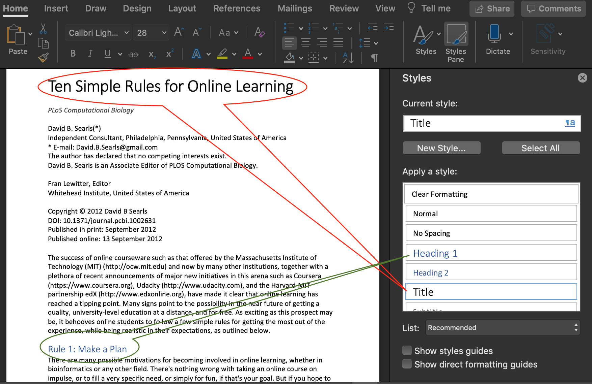
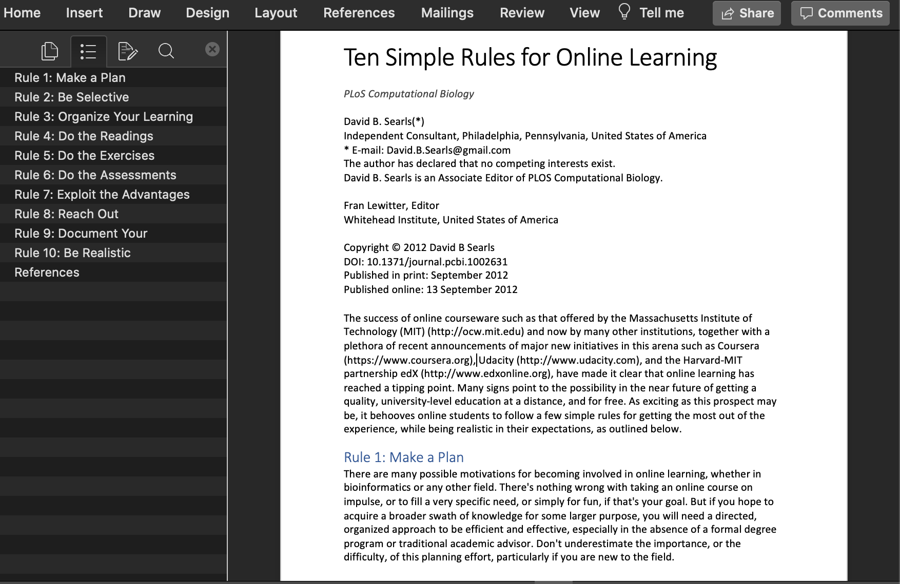
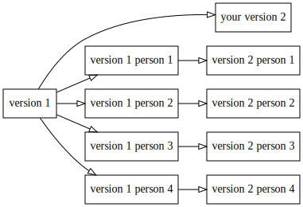

title: On computable numbers, with an application to the Entscheidungsproblem
author: Alan M. Turing
date: 28 May, 1936
...

# Introduction
The "computable" numbers may be described as the real numbers whose
expression as a decimal are calculable by finite means.
```

You probably have seen it in GitHub or Jupyter Notebooks

Same philosophy as LaTeX, but simpler

## Markdown's author says

<!-- cSpell:ignore Gruber swiss Powerpoint -->

> "The overriding design goal for Markdown’s formatting syntax is to make it as readable as possible.
>
> "The idea is that a Markdown-formatted document should be publishable as-is, as plain text, without looking like it’s been marked up with tags or formatting instructions."

::: source
John Gruber
<https://daringfireball.net/projects/markdown/>
:::

## Using Markdown in practice

There are dozens (maybe hundreds) of Markdown editors and compilers

They offer many extensions

They are not always compatible

There is not yet an official standard

**Recommendation**: pandoc

## Pandoc

> If you need to convert files from one markup format into another, pandoc is your swiss-army knife

Pandoc can convert between _many_ formats, including

+ Markdown
+ Microsoft Word/Powerpoint
+ LaTeX
+ Jupyter notebook

## Practical pandoc

+ You can write your main text in Markdown, and convert it into LaTeX

+ Pandoc understands LaTeX math expression, and can convert them to HTML or Microsoft Word

+ You can mix Markdown and LaTeX, and pandoc will keep the LaTeX part

## Pandoc advantages

+ Text files

+ It is easy to write tables in Markdown

+ It is easy to write lists

+ Can be used for slides
  + Several web platforms (like this document)
  + Microsoft Powerpoint

+ Handles BiBTeX references

::: notes
See examples in the source code
:::

## Collaborating using Markdown

Markdown files are text files

Thus, _git_ is the way to go

But if you want _real time_ collaboration, try [https://hackmd.io/](https://hackmd.io/){target="_blank"}

## RMarkdown and Quarto

+ Developed for R language, but supports Python and other languages
+ Syntax is Markdown + code
  + The code for each table and figure is included in the document
  + This is a big step towards _replicability_
+ R replaces each _code chunk_ with its result, and gives a plain Markdown file
+ It uses _pandoc_ to make Word/PDF/HTML
+ Can be shared using _git_

## RMarkdown v/s Jupyter Notebooks

Both are similar in spirit

+ Jupyter is like Excel. It is good to explore ideas
  + It is code with a lot of comments
+ RMarkdown is like Word. It is good to write a paper
  + It is text with just enough code

## Alternative: Microsoft Word

Depending on your _boundary conditions_, you may choose to use a WYSIWYG word processor

You can still follow the same philosophy:

+ Separate style from structure
+ Focus on content

## Style is not Structure {.large}

In word processors like Word®,  
_What You See Is What You Get_

This is sometimes called **WYSIWYG**

It is easy to change fonts, sizes, colors and other visual attributes, without paying attention to _structure_

## Structured Word documents {.no-gap .center-h .full-v .shadow}



## Now the document has structure {.no-gap .center-h .full-v .shadow}



## Collaborating {.center-h}

Sharing Word documents by email is a **VERY BAD IDEA**  
It leads to _chaos and confusion_



## Use an Online service

You can share your document via Dropbox or Google Drive

You can edit online using Microsoft Office 365 or Google Docs

Several people can work in the same document at the same time

**Advantage:** better spelling and grammar correction

But they require a permanent internet connection

## How I work with my students

When I collaborate with non-markdown people, we use Google Docs

+ We avoid using **bold** and _italics_
  + Exception: scientific names of species (e.g. _Homo sapiens_)
+ Instead we use _Styles_ to define the structure
+ I follow _pandoc_ rules for citations
+ Once finished, I export a Word file, and I convert it to Markdown using _pandoc_
+ We share the _code_ to produce every figure and table

# Collaborating {.center .good}

## Choosing roles and protocols

Define who are the authors early

Recommended reading:

“What Makes an Author.” Nature Methods 18, no. 9 (September 3, 2022): 983–983. <https://doi.org/10.1038/s41592-021-01271-8>.

Gewin, Virginia. “Steer Clear of Conflict.” Nature 594, no. 7863 (2022): 462–63.

## More recommendations

<!-- cSpell:ignore Weinberger Stefano Allesina Lortie Frassl Gewin Pomodoro Marieke -->

::: small
Weinberger, Cody J., James A. Evans, and Stefano Allesina. “Ten Simple (Empirical) Rules for Writing Science.” PLoS Computational Biology 11, no. 4 (2015): 11–13.

Lortie, Christopher J. “Ten Simple Rules for Writing Statistical Book Reviews.” PLoS Computational Biology 15, no. 1 (2019): 1–5.

Frassl, Marieke A., David P. Hamilton, et al. “Ten Simple Rules for Collaboratively Writing a Multi-Authored Paper.” PLoS Computational Biology 14, no. 11 (2018): 6–13.

Erren, T, P Cullen, M Erren, and P Bourne. “Ten Simple Rules for Doing Your Best Research, According to Hamming.” PLoS Computational Biology 3, no. 10 (January 1, 2007): e213.
:::

# Final comments {.center .good}

## Take care of yourself

+ Drink a lot of water
  + Especially when you drink alcohol
+ Get enough sleep
  + Don't fry your brain, you only have one
+ Try to make a routine. Minimize trivial decisions
  + Save your energy for important things
+ Go for a walk every day

## Become a writer

+ Write every day. No exceptions.
  + Start with 150 or 200 daily words
  + Ideal is 750 daily words

+ Once you see yourself as "someone who writes every day", it will be easy to write papers, projects, thesis, etc.

+ Get addicted to write, as you are addicted to social media

+ Try the _Pomodoro technique_

<!-- - define and agree on communication methods
    - Slack, -->

<!-- ## Practice
- avoid WYSIWYG (until the last minute)
- markdown/latex/pandoc/(Google docs+rules)

- When we have coauthors
    - Define who are the authors early
    - define and agree on communication methods
        - slack
    - Do not send attached word documents!
        - `doc-v1-real-final2.docx`
        - leads to a cacophony of version
    - Tools to collaborate
        - Shared folders
        - Github 
        - Docker
    - Online conversation -->

## References

[(please scroll to see more entries)]{.small}

::: {#refs .scroll}
:::

<!-- https://pandoc.org/try/
https://stackedit.io/
https://www.tablesgenerator.com/markdown_tables -->

<style>
.reveal blockquote {
    width: 90%;
    border: solid thin darkslategrey;
    box-shadow: 10px 10px 5px #aaaaaa;
    padding: 0 15px;
}
</style>
