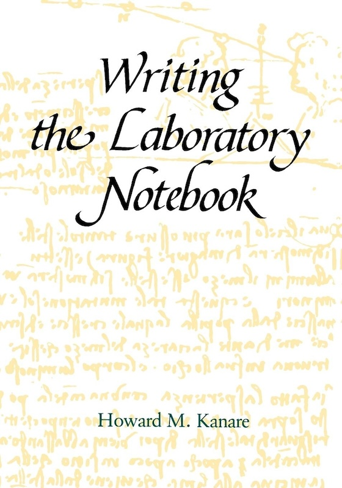

## **Welcome to Ph.D. student's life** {.center .Large}

Congratulations, by the way

## Doing a Ph.D. is an amazing experience {.center}

But it can also be stressful

## We want to present some ideas on how to (successfully) survive  your Ph.D. {.center}

## Some of them are endorsed by research {.center}

## Some of them are personal opinions {.center}

(informed by shared experiences)

## I am Andres Aravena

+ Assistant Professor at Istanbul University
+ Mathematical Engineer, U. of Chile
+ PhD Informatics, INRIA–U Rennes 1, France
+ PhD Mathematical Modeling, U. of Chile
+ Research interests:
  + machine learning for metagenomics
  + statistical analysis of gene expression
  + generative AI

<!-- ## Plan

+ Part 1
+ Short break
+ Part 2
+ Long break
+ Part 3
+ Short break
+ Part 4 -->

## Focus on Philosophy, not Tools

Tools will change in time. There will be new tools

You probably use tools that did not exist 10 years ago

And they often are a matter of _personal taste_

So we will focus on the _philosophy_ of the tools

(i.e. the part that will not change)

# Why do we need   good practices? {.center .good}

## We need good practices, because {.large .center .black background="yellow"}

[our mind fools us]{.Huge}

## We think we will never forget, but we do

> "I remember it now, therefore I will remember it forever"

When we see something or learn something, this fact is present in our short-term memory and we feel like we will always remember it

We forget that we forget

**Solution:** Use a journal (or lab notebook, or blog)

## We think our memories correspond to facts, but often they do not

> "Things were exactly as I remember"

Research shows that our memory is not at all a "recorder"

We misremember a lot

**Solution:** Use a journal

## We are bad at estimating projects' complexity

We think that we can finish a project in less time that it will really take

**Solution:**

+ Write in your journal how much time you worked every day
  + Tools like _Toggl Track_ can also be used
+ Reflect on how did you use your time

# Good practice 1  {.center .good}

Use a journal or a lab notebook

## Laboratory notebook {.fl-r .full-v .shadow}

In experimental sciences we record every experiment in a paper notebook

+ What is the purpose of the experiment
+ What is the expected output
+ What was the result, positive or negative
+ What were the lessons learned

::: source  
Kanare, H. M. (1985). _Writing the laboratory notebook_. American Chemical Society.  
:::

## Lab Notebooks are legal documents

In case you want to patent something, you need a Lab notebook

+ Bound pages, not coiled
+ Numbered pages
+ Sometimes written in duplicated
+ Periodically stamped by a trustworthy witness (a notary public)

You should at least carry a lab notebook in digital format

::: source  
Kanare, H. M. (1985). _Writing the laboratory notebook_. American Chemical Society.  
:::

## Logbooks and Commonplace books

In the navy it is a standard practice to _log_ everything

It was the 18th century version of a plane's black box

It was also typical for writers to carry a notebook to write notable extracts from texts

This was called a _Commonplace book_

Some other people used to write a _personal journal_ or _diary_

## Bullet journal {.fl-r .full-v .shadow}

A bullet journal is

+ A logbook, commonplace, journal, and to-do list combined
+ Paper based: easy to carry, not distracting
+ Numbered pages: easy to reference
+ Reviewed daily, weekly

Get a simple notebook and visit <https://bulletjournal.com/>

::: source  
Carroll, Ryder. 2018. _The Bullet Journal Method: Track the Past, Order the Present, Design the Future._  
New York: Portfolio, Penguin.
:::

::: notes  
show my BuJo.  
Don't believe the fancy BuJo you see on the web. They do not need to be beautiful
:::

## Key Ideas

+ Do not trust your memory
  + "Your mind is for having ideas, not holding them"
+ Write how you solved each problem every day
+ Write what you learned every day
  + "Today I learned..."
+ Keep an index for easy retrieval
+ Review your notes periodically and reflect
  + "Have a conversation with your past and your future self"

:::source
First quotation is from  
Allen, D. (2015). _Getting things done: The art of stress-free productivity._ Penguin Books.
:::

# More reasons for good practices {.good .center}

(other ways our mind fools us)

## We think that everybody knows what we know, so they do not need explanations

This is the _curse of knowledge_

> "I understand it, so everybody understands it"

It is **the main reason** why our text is hard to read

**Solution:** This one I'm still trying to figure out. Practice.

## We think that everything we do is easy

This is _Impostor Syndrome_

> "I'm not really that good, and one day they will realize I don't know anything"

We learn a little every day, so it never feels hard

But we accumulated learning in a large period,  
and it is hard to see how much we have learned

**Solution:** Look at your journal and _reflect_ on how much have you learned in the last year

## Impostor syndrome {.center .full-v}

::: source  
<https://xkcd.com/1954>
:::

## We don't know that we don't know

This is the _Dunning-Kruger_ effect

> "Incompetent, and unaware of it"

It is hard to improve if we don't know we are bad

**Solution:** Be open to criticism of your work

:::source  
Kruger, J., & Dunning, D. (1999). Unskilled and unaware of it: How difficulties in recognizing one’s own incompetence lead to inflated self-assessments. _Journal of Personality and Social Psychology_, _77_(6), 1121–1134.
:::

## You are not your work {.center .good-inv .Large}

## Two sides of the coin

Impostor Syndrome and Dunning-Kruger effect are mismatches between self-perception and other people's vision of us

To solve that, we can improve our _Communication_ with colleagues and collaborators

::: source
<https://www.explainxkcd.com/wiki/index.php/1954:_Impostor_Syndrome>  
:::

## **A Ph.D. goal is to produce and communicate new knowledge** {.center .black background="yellow" .Large}

(we call it "Doing Science")

## **The key word here is _communicate_** {.center}

What is the value of a result that is not made public?

# Keyword 1: Communication {.center .good}

## We communicate with our _collaborators_

Most of research is done in teams

Good practices help teamwork, by:

+ Keep track of what was (or was not) done
+ Coordinate next steps
+ Avoid work duplication

## …but I work alone…

Even if we work alone, we are still communicating

+ with your **supervisor** or **advisor**
+ with the **referees** of your paper
+ with **other scientists** that read (and cite) you
+ with the **next Ph.D. student** in your lab
+ with the **general public**
+ with our **future self**

Each one of these interactions can improve following a good practice

## Communicate with **your supervisor**

Research results are not enough

You must convince your boss (and the jury) that you deserve to be called "Doctor"

+ Make your work _easy to understand_

+ Make clear what is your original contribution

## …with the **referees** of your paper

Referees are busy people who works for free

+ Give them all they need to _replicate_ and _validate_ your work

+ Being _clear and transparent_ helps them to decide fast

You will get published faster  
(or at least get good feedback)

## …with **other scientists** in your field…

…that will read your paper (and hopefully cite it)

The game does not end when you publish

50% of papers are read only by the referee

+ Make your work easy to _understand_ and _replicate_

::: source  
Evans, J. A. (2008). Electronic Publication and the Narrowing of Science and Scholarship. Science, 321(5887), 395–399.  
:::

## …with the **general public**

Eventually, your work will have an impact outside academia

(the end goal is to make a better world, no?)

We need to be aware of the _ethical_ implications

+ Access, licensing, copyright models
+ Privacy concerning test subject
+ Truth and academic integrity

> This is reflected in the _Reproducibility Crisis_

## …with your **future self**

Nothing is more frustrating that reading your old work

As they say: "The past is a foreign country"

Undocumented code/protocols are hard to understand…

and you can only blame yourself

# Email {.center .good}

(also applies to WhatsApp, Slack, etc.)

## Essential parts

An email should provide just enough information to answer these five questions:

+ Who are you?
+ What do you want?
+ Why are you asking me?
+ Why should I do what you're asking?
+ What is the next step?”

::: source  
Guy Kawasaki, cited in
Vozza, Stephanie. 2013. _‘Productivity Lifesaver: The 5-Sentence Email’. Entrepreneur._ <https://morideno.com/write-five-sentences-about> (October 3, 2023).  
:::

## Not too long

> “Long emails are either unread or, if they are read, they are unanswered … Right now I have 600 read but unanswered emails in my inbox.”

:::smaller
Guy Kawasaki, cited by Stephanie Vozza in  
_‘Productivity Lifesaver: The 5-Sentence Email’_
:::

::: source  
_Entrepreneur_ website. <https://morideno.com/write-five-sentences-about> (October 3, 2023).  
:::

## Five sentences

"A Disciplined Way To Deal With Email"

E-mail takes too long to respond to, resulting in continuous inbox overflow for those who receive a lot of it.

Treat all email responses like SMS text messages, using a set number of letters per response. Since it’s too hard to count letters, we count sentences instead.

:::source
five.Sentenc.es <http://www.five.sentenc.es/>
:::

## Implementing "five sentences"

Write this as your signature

~~~
--------------------------------------------
Q: Why is this email five sentences or less?
A: http://five.sentenc.es
~~~

See also

+ [five.Sentenc.es](http://www.five.sentenc.es/)
+ [four.sentenc.es](http://four.sentenc.es/)
+ [three.sentenc.es](http://three.sentenc.es/)
+ [two.sentenc.es](http://two.sentenc.es/)

## Make it easy to notice

When someone gets many emails,

they decide which ones to read based on:

+ Who sent it
+ What is it about

That is, based on your name and the subject

## Does this work? {.shadow .center-h .full-h}

## Always write a Subject

The Subject should say why to read the message

+ Good: short and to the point

  > "Want to introduce my colleague. Coffee Tuesday or Wednesday?"

+ Bad examples:

  > "(No subject)", "message", "hello"

::: source  
<https://www.boomeranggmail.com/l/email-etiquette.html>{target="_blank"}  
:::

## You can even say everything in the subject

> "We wait for you at classroom 1 [EOM]"

Here "[EOM]" means "[End Of Message]"

This shows that theres is nothing more to say

All the message is in the subject

There is no need to open the email

::: source  
This seems a good idea but I have never used it nor seen used by anybody

<https://www.lifewire.com/what-is-eom-end-of-message-1171156>{target="_blank"}  
<https://blog.boomerangapp.com/2013/07/email-etiquette-how-to-write-subject-only-email/>{target="_blank"}  
:::

## What about this one? {.shadow .center-h .full-h}

Have I seen this person before?

## Choose well your picture

Most people are much better at recognizing faces than names

Some email platforms allow you to show your picture

(also applies to WhatsApp and similar apps)

Your picture should show your face clearly

## And about this one? {.shadow .center-h .full-h}

## Always include your full name {.fl-r}

Don't make people guess.  
Write your name the way you want to be called

Bad if too short or too long:

+ Pablo
+ Pablo Diego José Francisco de Paula Juan Nepomuceno María de los Remedios Cipriano de la Santísima Trinidad Ruiz y Picasso

Good if is the name you like people to call you

+ Pablo Picasso

:::source
"Pablo Picasso." (2023). In Wikipedia.
<https://en.wikipedia.org/wiki/Pablo_Picasso>
:::

<!-- ## Quoting previous message

+ mix questions and answers
+ Delete irrelevant text

## signature

make it short -->

## Write it backwards

It is easy to press `SEND` before attaching a file  
or before writing the subject

A good way of never forget them is to

1. Attach any attached file
2. Write the text explaining about the attached file
3. Write a one-phrase summary as subject
4. Write the recipient's email address
5. Press `SEND`

You cannot press `SEND` until you write the recipient's email

## Attachments

Email was designed for text. Plain text

It cannot handle "binary" (non-text) data

To attach a picture/document, it is encoded as text

This increases the file size by 33%

## Use attachments only if necessary

Worst offenders: short Word files, which could be copied-and-pasted in the email body

Use instead a shared folder in the cloud  
(more on that later)

**Exception:** To leave an explicit trace of a given document at a fixed date

(for example, students' homework)

# Be Explicit {.center .good}

## Be explicit on the weekday, the date and the time

If you collaborate with people abroad, remember that your 10am may not be their 10am

Sometimes your "tomorrow" is not their "tomorrow"

## Consider time zones

Use GMT/UTC based timezones.  
Other abbreviations are ambiguous  

+ AMT is Armenia Time or Amazon Time
+ CEST = CEDT = ECST = MESZ = UTC+2

# Let's have a break now {.center .good-inv}
