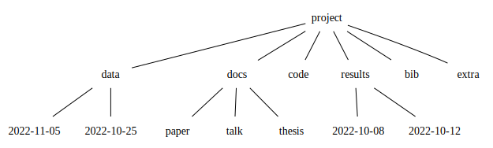

# Collaborating {.center .good}

## Collaborating {.center-h}

Sharing Word documents by email is a **VERY BAD IDEA**  
It leads to _chaos and confusion_


## {.center-h .full-v .shadow}


## Use an Online service

You can share your document via Dropbox or Google Drive

You can edit online using Microsoft Office 365 or Google Docs

Several people can work in the same document at the same time

**Advantage:** better spelling and grammar correction

But they require a permanent internet connection

## Where to store it

+ In the server only

+ Cloud drive like Dropbox, Google Drive
  + Good to share large data and non-text files
  + Bad if two people changes the same file
  + Works better with permanent internet access

+ Version control system like GitHub, GitLab, Bitbucket
  + Good for text and code, bad for big files
  + Keeps history
  + works well without internet access

## Never use Git in a shared folder  {.center .black background="yellow" .Large}

It can easily become corrupt

## Sharing

+ Hybrid, using symbolic links

+ Or use an online editor
  + Google Docs
  + HackMD.io
  + Overleaf

# Folder structure {.center .good}

## Prepare your files for the next user

> Someone unfamiliar with your project should be able to look at your computer files and understand in detail what you did and why

&nbsp;

::: source  
The ideas of this section are mostly based on  
William Stafford Noble. _“A Quick Guide to Organizing Computational Biology Projects.”_ PLoS Computational Biology 5, no. 7 (2009): 1–5. <https://doi.org/10.1371/journal.pcbi.1000424>.  
:::

## This “someone” could be

+ someone who wants to try to reproduce your work,
+ a collaborator who wants to understand your experiments,
+ a future student in your lab extending your work
  + after you have moved on to a new job,
+ your research advisor evaluating your research skills.

Most commonly, however, that “someone” is you.

::: source  
William Stafford Noble. _“A Quick Guide to Organizing Computational Biology Projects.”_ PLoS Computational Biology 5, no. 7 (2009): 1–5.  
:::

## Everything you do, you will probably have to do over again {.center}

## Folder structure for data projects {.center-h}



## Role of each folder

+ `docs` is where you write your paper/talk/thesis
+ `data` is anything that you get from outside the computer
+ `results` is what your code produces
+ `code` is where you write your code
+ `bib` to store documents cited in your document
  + if it has a _doi_, it goes here
  + bibliographic database goes here
+ `extra` for other documents without _doi_

## Use a script to build the structure {.fl-r}


Cookiecutter is a python tool to create new projects

You can find search for recipes in GitHub with a query like [`topic:cookiecutter` `topic:r`](https://github.com/search?q=topic%3Acookiecutter+topic%3Ar)

## Raw Data is Sacred

Producing data is expensive and time consuming

You don't want to lose it.
**Mark it _read only_ immediately**  
(and make backups)

Never modify raw data. Use a script to make a clean version

Use folders `raw` and `clean` inside `data/YYYY-MM-DD`  
Code for that in `scripts`

## Each folder needs a README file

Good filenames help a lot to understand the project

But they are usually not enough

A `README` file in each folder can explain the purpose of each file

It takes time to write them, but it saves time in the long run

# Filenames {.center .good}

## Be coherent when choosing filenames

Decide when to use `.`, `-`, and `_`

Avoid spaces in filenames

Either `John-Smith.txt` or `John_Smith.txt`

Usually `.` separates filetypes, like `.csv` or `.yml`

## Define a standard with your collaborators {.center}

Check periodically that you are following your standard  
(maybe with a script)

## Examples

### Bad Example

```
1-Introduction.docx
2_Methods.docx
3.Results.docx
4 discussion.docx
10-conclusions.docx
results-01-03-09.txt
```

### Good Example

```
01-Introduction.docx
02-Methods.docx
03-Results.docx
04-Discussion.docx
10-conclusions.docx
2009-01-03-results.txt
```

## Another Good Example

```
01_Introduction.docx
02_Methods.docx
03_Results.docx
04_Discussion.docx
10_conclusions.docx
20090103results.txt
```

Both are good, but use only one

## Write dates as YYYY-MM-DD

+ When was 8/3/1965? August or March?

+ Is today 6/10/2023 or 10/6/2023?

It is better to write YYYY-MM-DD. This is an ISO standard

There is no ambiguity of meaning

Sorting alphabetically, numerically, and chronologically give the same result

# Define your projects {.center .good}

## What is a "project"?

<!-- cSpell:ignore cookiecutter tiago schuster -->

We can distinguish four categories

+ _Projects_ with well-defined goals and deadlines, e.g. a thesis
+ _Areas_ that are permanently active, like "health" or "family"
+ _Resources_ that can be useful for several projects, like code libraries, or general interest papers
+ _Archives_, anything that is no longer active. Can be copied to external media and stored out of the computer

Each one requires a separate folder

:::source  
Tiago Forte
_Building a Second Brain_,
Simon and Schuster, 2022  
:::

## Spaces

Personally I like to group my Projects/Areas/Resources/ Archives by major topic

:::small

+ Teaching
  + Each course is a project
+ Research
+ Work
  + Contracts, bureaucracy
+ Personal
  + Health, Bank, Travel, Family
+ Learning
+ Hobby

:::

# Collaborative code writing {.center .good}

## Programs are not for computers

Well, they are _not only_ for computers

Once a program is too large for a single person, it should be written for
**Humans**

(including a future version of yourself)

## Do not be clever, be clear

It is tempting to write code that looks _brilliant_

It makes us feel smart

Unfortunately, this often makes the readers feel dumb

It is better to make readers feel smart

::: notes  
it has been my case  
:::

## Version control

If you develope code (or documents in text format), you will probably keep track of it in some _Version Control System_

Advantages

1. Keep history of the project so you can change your mind
2. Serves as backup of your project _on the cloud_
3. Enable a safe way to do experiments
4. Enables collaboration with many people, remotely
5. Does not need permanent internet access

## GIT

By far the most used VCS is **Git**

> _Learn to use it_

It has a command line interface, and many tools handle it directly  
(VScode, RStudio, JetBrains, etc.)

**Recommended:** if you use the command line, try `lazygit`

## Online platforms

Git is often used with a web platform like _GitHub_, _GitLab_, _BitBucket_ or similar, either public or private

## Commits

The key idea is to record **the changes** between code versions

These snapshots are called **commits**  
(identified by a long hexadecimal number)

Each commit has a **descriptive message**. Example:

+ `3e81b95` WIP
+ `da41c51` fix issues crated by cleanup
+ `1cddab7` cleanup backend (untested)
+ `484e061` small changes in tools

## Commit messages should be imperative

As if you were giving an order

That way your collaborators can know what the commit will do when applied

Which of these commit messages are clear to you?

+ WIP
+ fix issues crated by cleanup
+ cleanup backend (untested)
+ small changes in tools

## Branches

To develope new code but keep the working version, _Git_ uses **branches**

In other words a commit can be followed by several new commits

This allow freedom to do experiments, and roll back if they fail

The hard part is to **keep track** and **merge** them

<!-- If two people modified the same part of a file, there will be a conflict -->

## Issues

These sites add extra functionality. For instance, they allow us to track **issues** with the code

They can be used to organize code development

::: {.block style="width: 80%"}
Every issue describes a missing characteristic

The title should describe **what the state should be once the issue is solved**
:::

## Examples of issue names

## Branch names

A popular naming strategy is to use a prefix like `feature/` or `hotfix/`

In my experience these names are not clear enough

Online platforms allow you to create branches _from the issue page_

These branches have names corresponding to the issue

<https://github.com/anaraven/msr/issues/1>{target="_blank"}

<!-- # Structured Documents {.center .good}

## Structured documents

You probably know that using a good _data structure_ can dramatically improve an algorithm

And you use _structured programs_

The same applies to structuring our documents

Maybe you have used LaTeX, or Markdown

Maybe you know HTML

## Separation of concerns

The key idea is to describe _what things are_, not _how they look_

Describe the role of text, not the "looks"

Separate style from structure

::: source
This part is based on the ideas discussed in "LaTeX: A Document Preparation System" by Leslie Lamport (1986).
:::

## It is like a house {.large}

Structure makes the house solid and comfortable

If you only do decoration, the house looks nice but it is not solid

Structure of the walls come first

Painting the walls in a nice color is secondary

## Structural elements

+ Sections, subsections, paragraphs
+ Figures and Tables
+ Lists
+ References
+ Equations
+ Metadata
  + Title
  + Authors
  + Affiliations
  + Dates: submission, acceptance
  + Media/format -->

# Final comments {.center .good}

## Take care of yourself

+ Drink a lot of water
  + Especially when you drink alcohol
+ Get enough sleep
  + Don't fry your brain, you only have one
+ Try to make a routine. Minimize trivial decisions
  + Save your energy for important things
+ Go for a walk every day

## Become a writer

+ Write every day. No exceptions.
  + Start with 150 or 200 daily words
  + Ideal is 750 daily words

+ Once you see yourself as "someone who writes every day", it will be easy to write papers, projects, thesis, etc.

+ Get addicted to write, as you are addicted to social media

+ Try the _Pomodoro technique_

# Thank you! {.center .good}


<style>
.reveal .block {
  display: block;
  position: relative;
  margin: 20px auto;
  padding: 0px 25px;
  font-style: italic;
  box-shadow: 0px 0px 4px rgba(0, 0, 0, 0.6);
  }
</style>
