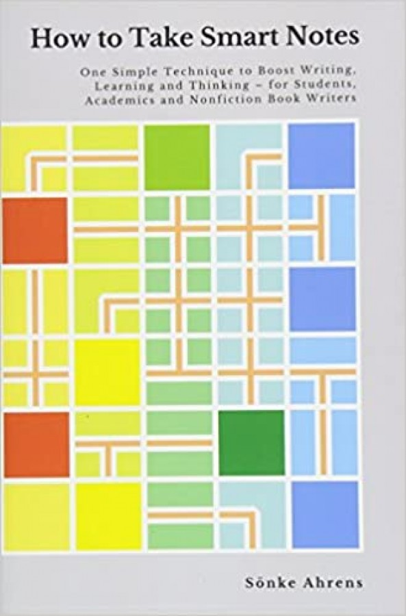

# What to do? {.center .good}

## Kanban {.fl-r .full-v .shadow}

+ Japanese idea
+ Good for teams, but also personal
+ Write tasks in postit cards
+ Put the cards in three or more columns
+ **Limit the size of _work in progress_**

## Example {.full-v .shadow .center-h}

## Digital version  {.full-v .shadow .center-h}

## Choosing what to do {.full-v .shadow .center-h}

# When to do it? {.center .good}

# Books {.center .good}

## Getting Things Done {.fl-r .full-v .shadow}

+ Collect everything in few _inboxes_
  + Mail Inbox
  + Download folder
  + Physical inbox
+ Process it regularly
  + Is it actionable?
    + two minute rule
  + Reference, Someday, Trash

## Bullet Journal {.fl-r .full-v .shadow}

+ Record daily
+ Review daily
+ Migrate daily/monthly
  + Decide what is important
+ Reflect

## Make Time {.fl-r .full-v .shadow}

+ Highlight
  + How do you want to remember this day?
+ Laser focus
  + Daily 90 minutes block
+ Energy
  + Walk in the nature
+ Reflect
  + did it work?

## Digital Minimalism  {.fl-r .full-v .shadow}

+ Avoid social media
+ It is an addiction
+ "Information Obesity"
+ "Cheap Calories"

## Pomodoro Technique {.fl-r .full-v .shadow}

+ Avoid procrastination
+ Commit to work for 25 minutes
  + Uninterrupted
  + Restart if broken
+ Use any timer, even a kitchen one
+ Stop for 5 minutes at the end of each cycle

## Deep work {.fl-r .full-v .shadow}

Block time away from interruptions

Use a calendar to block half days

## The Art of War {.fl-r .full-v .shadow}

+ Chinese general
+ minister to King Helü of Wu
+ 544–496 BC
+ Recommended lecture for business people

## The War of Art {.fl-r .full-v .shadow}

"There’s a secret that real writers know that wannabe writers don’t, and the secret is this:

It’s not the writing part that’s hard.

What’s hard is sitting down to write.

What keeps us from sitting down is Resistance.

## Resistance

"Resistance cannot be seen, touched, heard, or smelled.

"But it can be felt.

"We experience it as an energy field radiating from a work-in-potential.

"It’s a repelling force. It’s negative.

"Its aim is to shove us away, distract us, prevent us from doing our work."

## Things that trigger Resistance

"The following is a list, in no particular order, of activities that often trigger Resistance:

## 1. The pursuit of any calling in writing, painting, music, film, dance, or any creative art, however marginal or unconventional

## 2. The launching of any entrepreneurial venture or enterprise, for profit or otherwise

## 3. Any diet or health regimen

## 6. Any course or program designed to overcome an unwholesome habit or addiction

## In other words

any act that rejects immediate gratification in favor of long-term growth, health, or integrity.

any act that derives from our higher nature instead of our lower.

Any of these will elicit Resistance.

## Resistance marks the way {.center .black background="var(--color-yellow)"}

Use it as a compass

# Writing {.center .good}

## How to write a lot {.fl-r .full-v .shadow}

{style="height: 300px"}

+ Write every day
+ Get into the "writing addiction"
+ Writer's block does not exist
+ Use simple words

## Second Brain {.fl-r .full-v .shadow}

+ Zettelkasten
+ Write summaries with your own words
  + that forces you to understand
+ Write a link to other cards related to the new one
+ Can be done in paper, or in the computer

## Tools

+ Evernote
+ Notion
+ Roaming research
+ Obsidian

