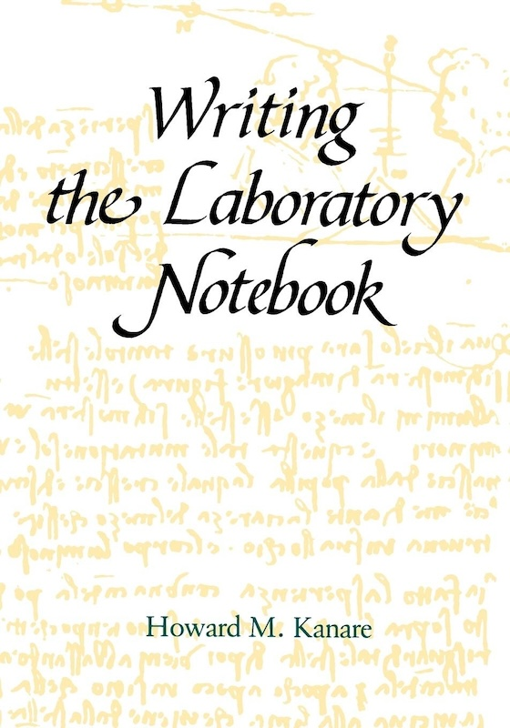

## We want to present some ideas on good practices for professional work {.center}

## Some of them are endorsed by research {.center}

## Some of them are personal opinions {.center}

(informed by shared experiences)

## I am Andres Aravena

+ Senior AI Engineer at Ennova-Research (Venice)
+ Former academic at Istanbul University
+ Mathematical Engineer, U. of Chile
+ PhD Informatics, INRIA–U Rennes 1, France
+ PhD Mathematical Modeling, U. of Chile

## I used to teach Bioinformatics

That is, a mix of Biology and Informatics

Every class **50%** of my students were *bored*

+ Some said I teach obvious things
+ Some said I teach incomprehensible things

The *50%* changed every class

Today will be similar

## Focus on Philosophy, not Tools

Tools will change in time. There will be new tools

You probably use tools that did not exist 10 years ago

And they often are a matter of *personal taste*

So we will focus on the *philosophy* of the tools

(i.e. the part that will not change)

# Why do we need   good practices? {.center .good}

## We need good practices, because {.large .center .black background="yellow"}

[our mind fools us]{.Huge}

## We think we will never forget, but we do

> "I remember it now, therefore I will remember it forever"

When we see or learn something, this fact is in our short-term memory and we feel like we will always remember it

We forget that we forget

**Solution:** Use a journal (or lab notebook, or blog)

## We think our memories correspond to facts, but often they do not

> "Things were exactly as I remember"

Research shows that our memory is not at all a "recorder"

We misremember a lot

**Solution:** Use a journal

## We are bad at estimating projects' complexity

We think that we can finish a project in less time that it will really take

**Solution:**

+ Write in your journal how much time you worked every day
  + Tools like *Toggl Track* can also be used
+ Reflect on how did you use your time

# Good practice 1  {.center .good}

Use a journal or a lab notebook

## Laboratory notebook {.fl-r .full-v .shadow}

In experimental sciences we record every experiment in a paper notebook

+ What is the purpose of the experiment
+ What is the expected output
+ What was the result, positive or negative
+ What were the lessons learned

::: source  
Kanare, H. M. (1985). *Writing the laboratory notebook*. American Chemical Society.  
:::

## Lab Notebooks are legal documents

In case you want to patent something, you need a Lab notebook

+ Bound pages, not coiled
+ Numbered pages
+ Sometimes written in duplicated
+ Periodically stamped by a trustworthy witness (a notary public)

You should at least carry a lab notebook in digital format

::: source  
Kanare, H. M. (1985). *Writing the laboratory notebook*. American Chemical Society.  
:::

## Logbooks and Commonplace books

In the navy it is a standard practice to *log* everything

It was the 18th century version of a plane's black box

It was also typical for writers to carry a notebook to write notable extracts from texts

This was called a *Commonplace book*

Some other people used to write a *personal journal* or *diary*

## Bullet journal {.fl-r .full-v .shadow}

A bullet journal is

+ A logbook, commonplace, journal, and to-do list combined
+ Paper based: easy to carry, not distracting
+ Numbered pages: easy to reference
+ Reviewed daily, weekly

Get a simple notebook and visit <https://bulletjournal.com/>

::: source  
Carroll, Ryder. 2018. *The Bullet Journal Method: Track the Past, Order the Present, Design the Future.*  
New York: Portfolio, Penguin.
:::

::: notes  
show my BuJo.  
Don't believe the fancy BuJo you see on the web. They do not need to be beautiful
:::

## Key Ideas

+ Do not trust your memory
  + "Your mind is for having ideas, not holding them"
+ Write how you solved each problem every day
+ Write what you learned every day
  + "Today I learned..."
+ Keep an index for easy retrieval
+ Review your notes periodically and reflect
  + "Have a conversation with your past and your future self"

:::source
First quotation is from  
Allen, D. (2015). *Getting things done: The art of stress-free productivity.* Penguin Books.
:::

# More reasons for good practices {.good .center}

(other ways our mind fools us)

## We think that everybody knows what we know, so they do not need explanations

This is the *curse of knowledge*

> "I understand it, so everybody understands it"

It is **the main reason** why our text is hard to read

**Solution:** This one I'm still trying to figure out. Practice.

## We think that everything we do is easy

This is *Impostor Syndrome*

> "I'm not really that good, and one day they will realize I don't know anything"

We learn a little every day, so it never feels hard

But we accumulated learning in a large period,  
and it is hard to see how much we have learned

**Solution:** Look at your journal and *reflect* on how much have you learned in the last year

## Impostor syndrome {.center .full-v}

::: source  
<https://xkcd.com/1954>
:::

## We don't know that we don't know

This is the *Dunning-Kruger* effect

> "Incompetent, and unaware of it"

It is hard to improve if we don't know we are bad

**Solution:** Be open to criticism of your work

:::source  
Kruger, J., & Dunning, D. (1999). Unskilled and unaware of it: How difficulties in recognizing one’s own incompetence lead to inflated self-assessments. *Journal of Personality and Social Psychology*, *77*(6), 1121–1134.
:::

## You are not your work {.center .good-inv .Large}

## Two sides of the coin

Impostor Syndrome and Dunning-Kruger effect are mismatches between self-perception and other people's vision of us

To solve that, we can improve our *Communication* with colleagues and collaborators

::: source
<https://www.explainxkcd.com/wiki/index.php/1954:_Impostor_Syndrome>  
:::

## **A Ph.D. goal is to produce and communicate new knowledge** {.center .black background="yellow" .Large}

(we call it "Doing Science")

## **The key word here is *communicate*** {.center}

What is the value of a result that is not made public?

# Keyword 1: Communication {.center .good}

## We communicate with our *collaborators*

Most of research is done in teams

Good practices help teamwork, by:

+ Keep track of what was (or was not) done
+ Coordinate next steps
+ Avoid work duplication

## …but I work alone…

Even if we work alone, we are still communicating

+ with your **supervisor** or **advisor**
+ with the **referees** of your paper
+ with **other scientists** that read (and cite) you
+ with the **next Ph.D. student** in your lab
+ with the **general public**
+ with our **future self**

Each one of these interactions can improve following a good practice

## Communicate with **your supervisor**

Research results are not enough

You must convince your boss (and the jury) that you deserve to be called "Doctor"

+ Make your work *easy to understand*

+ Make clear what is your original contribution

## …with the **referees** of your paper

Referees are busy people who works for free

+ Give them all they need to *replicate* and *validate* your work

+ Being *clear and transparent* helps them to decide fast

You will get published faster  
(or at least get good feedback)

## …with **other scientists** in your field…

…that will read your paper (and hopefully cite it)

The game does not end when you publish

50% of papers are read only by the referee

+ Make your work easy to *understand* and *replicate*

::: source  
Evans, J. A. (2008). Electronic Publication and the Narrowing of Science and Scholarship. Science, 321(5887), 395–399.  
:::

## …with the **general public**

Eventually, your work will have an impact outside academia

(the end goal is to make a better world, no?)

We need to be aware of the *ethical* implications

+ Access, licensing, copyright models
+ Privacy concerning test subject
+ Truth and academic integrity

> This is reflected in the *Reproducibility Crisis*

## …with your **future self**

Nothing is more frustrating that reading your old work

As they say: "The past is a foreign country"

Undocumented code/protocols are hard to understand…

and you can only blame yourself
