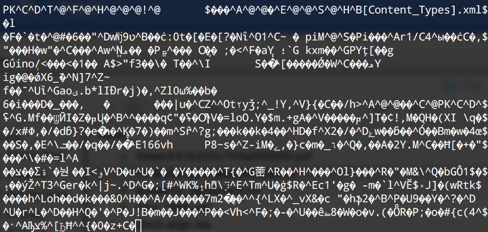
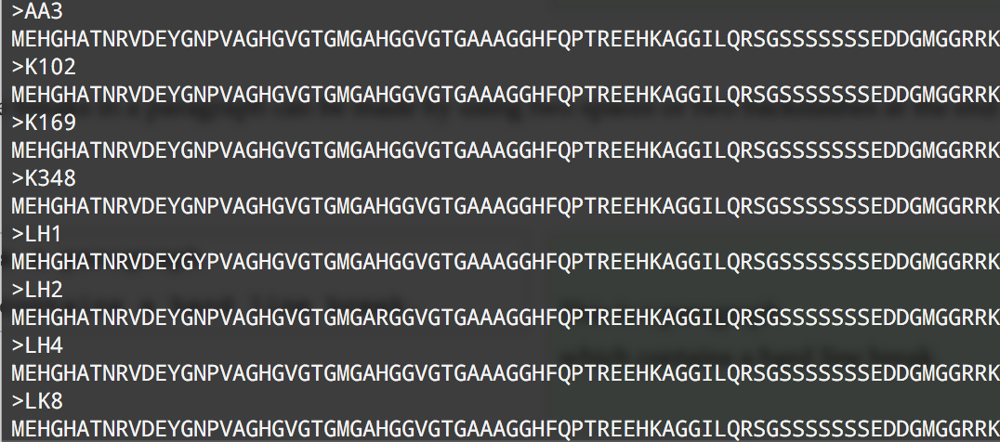
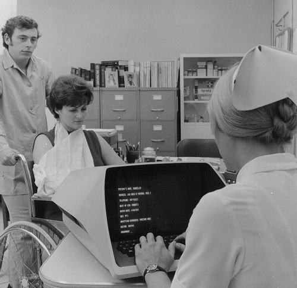
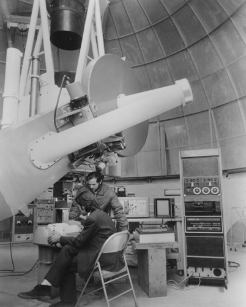
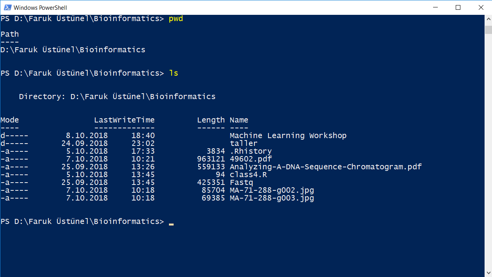
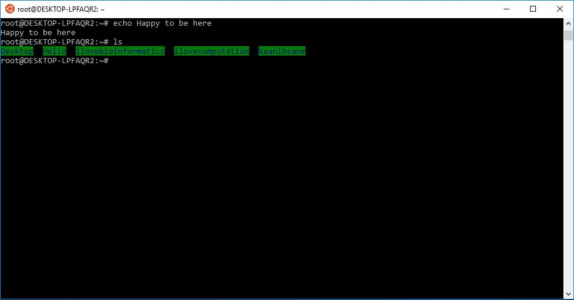

## I am Andres Aravena

+ Senior AI Engineer at Ennova-Research (Venice)
+ Former academic at Istanbul University
+ Mathematical Engineer, U. of Chile
+ PhD Informatics, INRIA–U Rennes 1, France
+ PhD Mathematical Modeling, U. of Chile

## I used to teach Bioinformatics

That is, a mix of Biology and Informatics

Every class **50%** of my students were *bored*

+ Some said I teach obvious things
+ Some said I teach incomprehensible things

The *50%* changed every class

Today will be similar

## Focus on Philosophy, not Tools

Tools will change in time. There will be new tools

You probably use tools that did not exist 10 years ago

And they often are a matter of *personal taste*

So we will focus on the *philosophy* of the tools

(i.e. the part that will not change)

## Kinds of file

At low level there is only one type of file

For us, it is useful to separate in two:

Text Files
:   each byte is a *character*, we can read it

Binary Files
:   bytes are grouped in binary numbers, representing images, sounds, etc.

Among *binary* files we have EXE files, which are *programs* for Windows

## Text Files are good

+ They are universal
+ They are easy to read and write from a program

Also

+ They do not have any style like **bold** or *italic*
+ They are like books without figures

**Microsoft Word** files (`doc` or `docx`) are ***NOT*** text files

## Example binary file {.no-gap .full-h}

## Example text file {.no-gap .full-h}

# Text files are for humans and computers {.center .good}

## Text files are for humans and computers

+ Binary files are hard to read
  + unless you have the correct program
+ Text files can be read by humans
  + Each byte is a letter
+ Text files can be read by computers
  + Data must be **recyclable**
  + The output of one program is the input of another program

## What is UNIX?

UNIX is an *operating system*

+ invented in 1969 at Bell Labs (AT&T)
+ developed in the 1970s
+ under constant development ever since
+ multi-user
+ multi-tasking
+ system for servers, desktops and laptops.

## Computer were big and expensive {.no-gap .full-h}

Several people used the same computer
at the same time

## Each person used a *dumb* terminal {.center-h}

## Each computer had its own system {.no-gap .full-v .center-h}

## Engineers designed UNIX to work in all servers {.no-gap .full-v .center-h}

## UC Berkeley adapted UNIX for research {.no-gap .full-v .center-h}

## All UNIX systems have a **text** interface

UNIX systems also have a graphical user interface (GUI)

+ similar to Microsoft Windows
+ easy to use environment

However, **command line** interface is also used

+ for operations which aren't covered by a graphical program
+ when there is no windows interface available
  + for example, using a cloud server

## So this...  {.no-gap .full-v .center-h}

## ... became this {.no-gap .full-v .center-h}

## Using Command line inside Windows {.full-v .no-gap .center-h}

## Power shell {.full-v .no-gap .center-h}

## Git-Bash for Windows {.full-v .no-gap .center-h}

## Linux subsystem for Windows {.full-v .no-gap .center-h}

## Operating system

Set of programs which make the computer work.

The UNIX operating system is made up of three parts:

+ the kernel
+ the shell
+ the programs

## Parts of UNIX {.no-gap .full-v .center-h}

## The kernel

The kernel of UNIX is the hub of the operating system:

+ it manages time and memory for programs
+ handles the disk and secondary storage
+ handles communications and networking

The **kernel** wraps the different hardware. No other software can interact with the hardware.

Programs have to *ask* to the kernel to access the hardware

## The shell {.no-gap}

Interface between the user and the kernel

When a user logs in

+ the system checks the username and password
+ then starts another program called the **shell**
  + a command line interpreter (CLI).
+ it shows a prompt `$`
+ It interprets the commands the user types and executes them
+ The commands are programs
+ When they finish, the shell gives the user another prompt `$`

# Tricks of the shell

## Filename Completion

By typing part of the name of a command, filename or directory and pressing the [**Tab**] key, the shell will complete the rest of the name automatically.

 If the shell finds more than one name beginning with those letters you have typed, it will beep, asking you to type a few more letters before pressing the tab key again.

## History

The shell keeps a list of the commands you have typed in

If you need to repeat a command,

+ use the cursor keys to move up and down in history
+ or type `history` for a list of previous commands

## The Directory Structure {.fl-r}

{width="560" height="316"}

All the files are grouped together in the directory structure

+ The file-system is arranged in a hierarchical structure
  + like an inverted tree
+ The top of the hierarchy is called **root**
  + written as  `/`

## The Directory Structure {.fl-r}

{width="560" height="316"}

In the diagram above, we see that the home directory of the user `ee51vn` contains two sub-directories (`docs` and `pics`) and a file called `report.doc`

The full path to the file `report.doc` is `/home/its/ug1/ee51vn/report.doc`

# Listing files and directories {.center .good}

## `ls` (list)

When you first login, your current working directory is your home directory

To find out what is in your home directory, type

    ls

The `ls` command ( lowercase L and lowercase S ) lists the contents of your current working directory.

## `ls` command {.center-h .full-v .no-gap}

{height="269"}

## There may be no files visible

In that case, the UNIX prompt will be returned

`ls` does not show all the files but only those ones whose name does not begin with a dot `.`

Files beginning with a dot `.` are known as hidden files and usually contain important program configuration information.

They are hidden because you should not change them unless you are very familiar with UNIX!!!

## Listing hidden files {.center-h}

To list all files in your home directory including those whose names begin with a dot, type

    ls -a

{width="491" height="269"}

## Commands can have options

`ls` is an example of a command which can take options: `-a` is an example of an option.

The options change the behaviour of the command.

There are online manual pages that tell you which options a particular command can take, and how each option modifies the behaviour of the command

## How to know the options? {.fl-r}

In the old times, people looked it in the "Manual"

Later people realized that you can have the manual in *digital* form, inside the computer

To see the manual page of `ls`, use the command `man ls`

## The shell|Interface between the user and the kernel {.no-gap}

When a user logs in

+ the system checks the username and password
+ then starts another program called the **shell**
  + a command line interpreter (CLI).
+ it shows a prompt `$`
+ It interprets the commands the user types and executes them
+ The commands are programs
+ When they finish, the shell gives the user another prompt `$`

## Original material

This class is a derived work from
<http://www.ee.surrey.ac.uk/Teaching/Unix/>

M.Stonebank\@surrey.ac.uk, © 9th October 2000

::: center-h

  
Licensed under a [Creative Commons License](http://creativecommons.org/licenses/by-nc-sa/2.0/)
:::

<!-- /Creative Commons License -->
<!--
<rdf:RDF xmlns="http://web.resource.org/cc/"
    xmlns:dc="http://purl.org/dc/elements/1.1/"
    xmlns:rdf="http://www.w3.org/1999/02/22-rdf-syntax-ns#">
<Work rdf:about="">
   <dc:title>UNIX Tutorial for Beginners</dc:title>
   <dc:date>1995</dc:date>
   <dc:description>Introduction to the UNIX operating system.  Eight simple tutorials which cover the basics of UNIX.</dc:description>
   <dc:creator><Agent>
      <dc:title>Michael Stonebank</dc:title>
   </Agent></dc:creator>
   <dc:type rdf:resource="http://purl.org/dc/dcmitype/Text" />
   <license rdf:resource="http://creativecommons.org/licenses/by-nc-sa/2.0/" />
</Work>

<License rdf:about="http://creativecommons.org/licenses/by-nc-sa/2.0/">
   <permits rdf:resource="http://web.resource.org/cc/Reproduction" />
   <permits rdf:resource="http://web.resource.org/cc/Distribution" />
   <requires rdf:resource="http://web.resource.org/cc/Notice" />
   <requires rdf:resource="http://web.resource.org/cc/Attribution" />
   <prohibits rdf:resource="http://web.resource.org/cc/CommercialUse" />
   <permits rdf:resource="http://web.resource.org/cc/DerivativeWorks" />
   <requires rdf:resource="http://web.resource.org/cc/ShareAlike" />
</License>
</rdf:RDF>
-->

Images from: `archive.computerhistory.org`, `staff.salisbury.edu/~rafantini`

