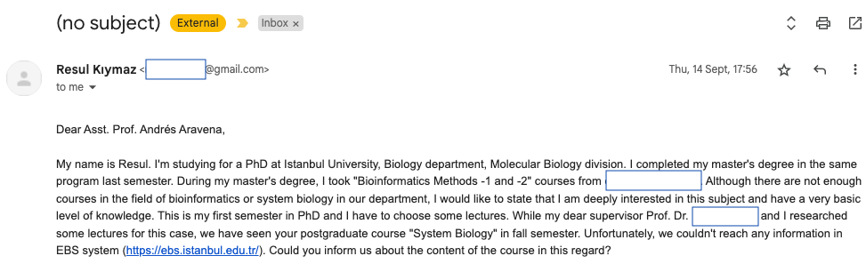
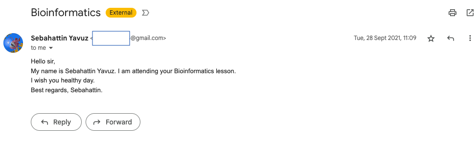
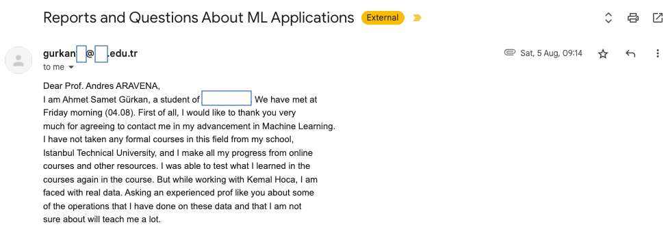

# Email {.center .good}

(also applies to WhatsApp, Slack, etc.)

## Essential parts

An email should provide just enough information to answer these five questions:

+ Who are you?
+ What do you want?
+ Why are you asking me?
+ Why should I do what you're asking?
+ What is the next step?”

::: source  
Guy Kawasaki, cited in
Vozza, Stephanie. 2013. _‘Productivity Lifesaver: The 5-Sentence Email’. Entrepreneur._ <https://morideno.com/write-five-sentences-about> (October 3, 2023).  
:::

## Not too long

> “Long emails are either unread or, if they are read, they are unanswered … Right now I have 600 read but unanswered emails in my inbox.”

:::smaller
Guy Kawasaki, cited by Stephanie Vozza in  
_‘Productivity Lifesaver: The 5-Sentence Email’_
:::

::: source  
_Entrepreneur_ website. <https://morideno.com/write-five-sentences-about> (October 3, 2023).  
:::

## Five sentences

"A Disciplined Way To Deal With Email"

E-mail takes too long to respond to, resulting in continuous inbox overflow for those who receive a lot of it.

Treat all email responses like SMS text messages, using a set number of letters per response. Since it’s too hard to count letters, we count sentences instead.

:::source
five.Sentenc.es <http://www.five.sentenc.es/>
:::

## Implementing "five sentences"

Write this as your signature

~~~
--------------------------------------------
Q: Why is this email five sentences or less?
A: http://five.sentenc.es
~~~

See also

+ [five.Sentenc.es](http://www.five.sentenc.es/)
+ [four.sentenc.es](http://four.sentenc.es/)
+ [three.sentenc.es](http://three.sentenc.es/)
+ [two.sentenc.es](http://two.sentenc.es/)

## Make it easy to notice

When someone gets many emails,

they decide which ones to read based on:

+ Who sent it
+ What is it about

That is, based on your name and the subject

## Does this work? {.shadow .center-h .full-h}

## Always write a Subject

The Subject should say why to read the message

+ Good: short and to the point

  > "Want to introduce my colleague. Coffee Tuesday or Wednesday?"

+ Bad examples:

  > "(No subject)", "message", "hello"

::: source  
<https://www.boomeranggmail.com/l/email-etiquette.html>{target="_blank"}  
:::

## You can even say everything in the subject

> "We wait for you at classroom 1 [EOM]"

Here "[EOM]" means "[End Of Message]"

This shows that theres is nothing more to say

All the message is in the subject

There is no need to open the email

::: source  
This seems a good idea but I have never used it nor seen used by anybody

<https://www.lifewire.com/what-is-eom-end-of-message-1171156>{target="_blank"}  
<https://blog.boomerangapp.com/2013/07/email-etiquette-how-to-write-subject-only-email/>{target="_blank"}  
:::

## What about this one? {.shadow .center-h .full-h}

Have I seen this person before?

## Choose well your picture

Most people are much better at recognizing faces than names

Some email platforms allow you to show your picture

(also applies to WhatsApp and similar apps)

Your picture should show your face clearly

## And about this one? {.shadow .center-h .full-h}

## Always include your full name {.fl-r}

Don't make people guess.  
Write your name the way you want to be called

Bad if too short or too long:

+ Pablo
+ Pablo Diego José Francisco de Paula Juan Nepomuceno María de los Remedios Cipriano de la Santísima Trinidad Ruiz y Picasso

Good if is the name you like people to call you

+ Pablo Picasso

:::source
"Pablo Picasso." (2023). In Wikipedia.
<https://en.wikipedia.org/wiki/Pablo_Picasso>
:::

<!-- ## Quoting previous message

+ mix questions and answers
+ Delete irrelevant text

## signature

make it short -->

## Write it backwards

It is easy to press `SEND` before attaching a file  
or before writing the subject

A good way of never forget them is to

1. Attach any attached file
2. Write the text explaining about the attached file
3. Write a one-phrase summary as subject
4. Write the recipient's email address
5. Press `SEND`

You cannot press `SEND` until you write the recipient's email

## Attachments

Email was designed for text. Plain text

It cannot handle "binary" (non-text) data

To attach a picture/document, it is encoded as text

This increases the file size by 33%

## Use attachments only if necessary

Worst offenders: short Word files, which could be copied-and-pasted in the email body

Use instead a shared folder in the cloud  
(more on that later)

**Exception:** To leave an explicit trace of a given document at a fixed date

(for example, students' homework)

# Be Explicit {.center .good}

## Be explicit on the weekday, the date and the time

If you collaborate with people abroad, remember that your 10am may not be their 10am

Sometimes your "tomorrow" is not their "tomorrow"

## Consider time zones

Use GMT/UTC based timezones.  
Other abbreviations are ambiguous  

+ AMT is Armenia Time or Amazon Time
+ CEST = CEDT = ECST = MESZ = UTC+2

# Let's have a break now {.center .good-inv}
