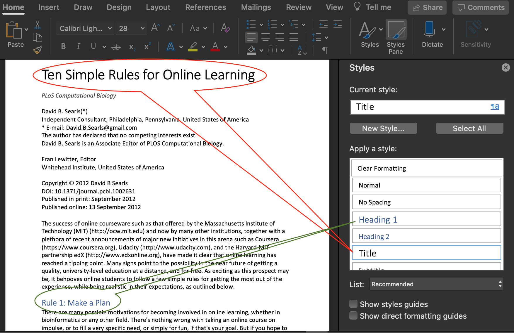
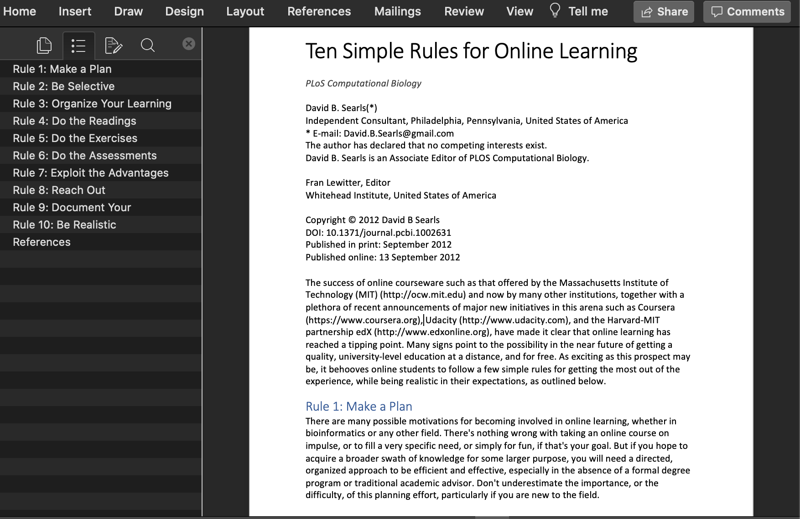

## Structured documents

<!-- markdownlint-disable MD040 MD033 MD036 -->

You probably know that using a good _data structure_ can dramatically improve an algorithm

And you use _structured programs_

The same applies to structuring our documents

## Separation of concerns

<!-- cSpell:ignore Lamport Entscheidungsproblem beamer -->

Separate style from structure

Describe the role of text, not the "looks"

The key idea is to describe _what things are_, not _how they look_

::: source
This part is based on the ideas discussed in "LaTeX: A Document Preparation System" by Leslie Lamport (1986).
:::

## It is like a house {.large}

Structure makes the house solid and comfortable

If you only do decoration, the house looks nice but it is not solid

Structure of the walls come first

Painting the walls in a nice color is secondary

## Structural elements

+ Sections, subsections, paragraphs
+ Figures and Tables
+ Lists
+ References
+ Equations
+ Metadata
  + Title
  + Authors
  + Dates

## Structured Word documents {.no-gap .center-h .full-v .shadow}



## Now the document has structure {.no-gap .center-h .full-v .shadow}



# Text documents are good {.good .center}

## Text files are for humans and computers

+ Binary files are hard to read
  + unless you have the correct program
+ Text files can be read by humans
  + Each byte is a letter
+ Text files can be read by computers
  + Data must be **recyclable**
  + The output of one program may be the input of another program

## Text editors instead of Word processors {.large}

The easiest way to handle _text files_ is to use a **text editor**

These are programs to view and edit text files

```
They use a monospaced font, like Courier

Each letter has the same width
```

## Text editor have syntax coloring {.large}

Since each letter has the same size, text editor use color

The color depends on the **role** of each text

For example, _headings_ can be in red color

**The color is not in the file. The editor puts colors**

## Text files are for ever {.Large}

Free

+ nothing to pay

+ you can do whatever you want

Never get obsolete

# But they do not have structure {.good-inv .center}

## Structured Documents {.large}

We want to identify the _meaning_, not the _shapes_

+ Title
+ Sections
  + Subsections
    + Lists
    + Figures
    + Tables
+ References to other works

NOT _bold_ or _italic_ or _centered_

## Separation of concerns in practice

The key idea is to describe _what things are_, not _how they look_

Describe the role of text, not the "looks"

Separate style from structure

# Structure without style {.center .good}

## Text files with structure

There are several markup languages that encode the structure of a _text_ document

+ LaTeX
+ ReStructured Text
+ MediaWiki
+ HTML
+ Markdown
+ Textile
+ AsciiDoc

## Marking structure in plain text

Since text files have only one type of letter, we use some symbols as "magic"

For example `\` or `@`

If you write a "magic" symbol, you tell the computer that the next symbol shows a change of format

This is called **Markup Language**

## TeX {.fl-r}

{height="500px"}

An important system to prepare documents in the computer was invented in the 70's by Donald Knuth, who is probably the most important computer scientist of the last 70 years.

Donald Knuth won the Turing Award in 1974

## Knuth invented TeX to write this


## LaTeX {.fl-r}


TeX has styles but not structure. In the 80's Leslie Lamport created LaTeX as an extension of TeX

Leslie Lamport won the Turing Award in 2013

## Example: writing in LaTeX

<!-- show the same document as in Word, in source and compiled -->

A LaTeX document looks like this

```latex
\documentclass[a4paper]{article}
\title{Ten Simple Rules for Online Learning}
\author{David B. Searls}
\date{13 September 2012}
\begin{document}
\section{Rule 1: Make a Plan}
There are many possible motivations for becoming involved in online learning…
\end{document}
```

LaTeX files are text files. They will never be obsolete.

Changing the `documentclass` will change the document _look_

## LaTeX files are _text files_

+ Independent of any provider

+ Use your favorite text editor (VScode?)

+ Version control friendly (GitHub?)

+ Can probably still be read 20 years from now

We cannot say the same about Microsoft Word

## Good ideas in LaTeX

+ Chapters, sections, subsections
+ Automatic creation of Table of Contents
+ Automatic numbering of sections, figures, tables
+ Cross referencing sections, figures, tables
+ Floating figures
+ Math formulas
+ Bibliographic references

## Writing Math Expressions

LaTeX is favored by people who writes mathematical formulas

```latex
$$(a+b)^n=\sum_{k=0}^n \frac{n!}{k!(n-k)!} a^k b^{n-k}$$
```

$$(a+b)^n=\sum_{k=0}^n \frac{n!}{k!(n-k)!} a^k b^{n-k}$$

You can use this syntax in Microsoft Word's Equation Editor

Learning how to write math is a good investment

## LaTeX disadvantages

+ LaTeX is hard to learn
  + This discourages many people
  + Your collaborators may not use it
  + You need to have the Reference Manual at hand
+ It is oriented to producing printed material
  + It produces PDF files or equivalents
  + Not suitable for Web or eBook
+ Writing tables is hard

# Web pages {.center .good}

## Web Pages

In the 90's most computers had good graphic capabilities and Internet access

Researchers at CERN invented the web, using "hyper-text"

(That is, text with links to other text)

Web pages are written in _Hyper Text Markup Language_

## HTML

These are also _text files_. It looks like this:

```html
<head>
<title>Ten Simple Rules for Online Learning</title>
</head>
<body>
<h1>Rule 1: Make a Plan</h1>
There are many possible motivations for becoming involved in online learning…
</body>
```

## Good ideas from HTML

+ Works well on the screen: adapts to screen size

+ Links to other pages

+ Structural elements
  + `<h1>…</h1>` marks Header level 1
  + There are also `<h2>`…`<h6>`

+ Comments: `<!-- this part is not shown -->`

+ Structure separated from Style
  + Style is defined in CSS files

## Disadvantages of HTML

+ It does not work well for paper

+ It is hard to write manually

+ There are editors, but they often focus on style, not structure

## Alternative: Markdown

It is a light markup system that can be easily converted into any other format

```md
---
title: Ten Simple Rules for Online Learning
author: David B. Searls
date: 13 September 2012
---

# Rule 1: Make a Plan

There are many possible motivations for becoming involved in online learning…
```

## Markdown

_Markdown_ is a widely used markup language

+ Same philosophy as LaTeX, but simpler

+ The text file can be read and understood easily

+ It can be transformed into other formats
  + PDF, Word, Webpage (HTML)

+ Used in R, Python, Julia (Jupyter), in GitHub, and many other modern platforms

## Markdown's author says

<!-- cSpell:ignore Gruber swiss Powerpoint -->

> "The overriding design goal for Markdown’s formatting syntax is to make it as readable as possible.
>
> "The idea is that a Markdown-formatted document should be publishable as-is, as plain text, without looking like it’s been marked up with tags or formatting instructions."

::: source
John Gruber
<https://daringfireball.net/projects/markdown/>
:::

## _Flavors_ of Markdown

**Compiling** is transforming from Markdown to other format

There are many different Markdown compilers

Many people make their own compiler, and they expand the original idea

Unfortunately, they are not always 100% compatible

There is not yet an official standard

**Recommendation**: _pandoc_

## _Pandoc_

> If you need to convert files from one markup format into another, _pandoc_ is your swiss-army knife
>
> John MacFarlane, developer of Pandoc

_Pandoc_ can convert between _many_ formats, including

+ Markdown
+ Microsoft Word/Powerpoint
+ LaTeX
+ Jupyter notebook

<!-- ## Why I no longer use LaTeX

+ You can write your main text in Markdown, and convert it into LaTeX

+ _Pandoc_ understands LaTeX math expression, and can convert them to HTML or Microsoft Word

+ You can mix Markdown and LaTeX, and _pandoc_ will keep the LaTeX part -->

## John MacFarlane {.fl-r .small}


Professor of Philosophy, University of California, Berkeley

Author of books

+ Philosophical Logic: A Contemporary Introduction
+ Assessment Sensitivity: Relative Truth and Its Applications

Recent papers:

+ “Lecture I: Vagueness and Communication”
+ “Lecture II: Seeing Through the Clouds”
+ “Lecture III: Indeterminacy as Indecision”
+ “On Probabilistic Knowledge”

## _Pandoc_ advantages

+ Text files

+ It is easy to write tables in Markdown

+ It is easy to write lists

+ Can be used for slides
  + Several web platforms (like this document)
  + Microsoft Powerpoint

+ Handles BiBTeX references

::: notes
See examples in the source code
:::

## Using Pandoc

It is a command line command, and can be used inside VSCode

There is even a plugin

In the command line we write

```sh
pandoc document.md --output document.pdf
```

and there are many options. See <https://pandoc.org>

# Markdown format {.center .good}

## Paragraphs

+ Consecutive lines of text are  one paragraph.
+ They are separated by an empty line

```
The first paragraph.

Another paragraph
```

<p>The first paragraph.<p>
Another paragraph

## Headers {.no-gap}

```
# Header 1
## Header 2
### Header 3
#### Header 4
```

<p style="font-size: 150%;font-weight: bold;">Header 1</p>
<p style="font-size: 120%;font-weight: bold;">Header 2</p>
<p style="font-size: 120%;font-style: italic;">Header 3</p>
<p style="font-size: 110%;font-family: cursive;">Header 4</p>

<!-- ## Alternative header format

Not recommended

```
First level header
==================

Second level header
-------------------

Normal text
```

<p style="font-size: 150%; font-weight: bold;">First level header</p>
<p style="font-size: 120%; font-weight: bold;">Second level header</p>
Normal text -->

## Unordered Lists {.no-gap}

```
+ Item 1
+ Item 2
    + Item 2a
    + Item 2b
```

<blockquote>
+ Item 1
+ Item 2
    + Item 2a
    + Item 2b
</blockquote>

Sub-lists are indented by 4 spaces

## Ordered Lists {.no-gap}

```
1. Item 1
1. Item 2
1. Item 3
    1. Item 3a
    1. Item 3b
```

<blockquote>
1. Item 1
1. Item 2
1. Item 3
    1. Item 3a
    1. Item 3b
</blockquote>

## Images

You have to indicate the web address of the image

```

```

or the name of a file in the same directory

```

```

\

## Tables

There are several formats. The easiest one is this

```
|   | sample   | dose | time  | agent            |
|---|----------|------|-------|------------------|
| 1 | GSM91440 | low  | 5 min | caffeine         |
| 2 | GSM91893 | low  | 5 min | caffeine         |
| 3 | GSM91428 | low  | 5 min | calcofluor white |
| 4 | GSM91881 | low  | 5 min | calcofluor white |
```

|   | sample   | dose | time  | agent            |
|---|----------|------|-------|------------------|
| 1 | GSM91440 | low  | 5 min | caffeine         |
| 2 | GSM91893 | low  | 5 min | caffeine         |
| 3 | GSM91428 | low  | 5 min | calcofluor white |
| 4 | GSM91881 | low  | 5 min | calcofluor white |

## Computer code

Programs are usually written in a _monospaced_ font.  
That is, all letters have the same width.

~~~
```
this <- is.computer(code) {
    # comment
}
```
~~~

```
this <- is.computer(code) {
    # comment
}
```

## Nicer computer code

You can indicate the language, and get colors

~~~
```r
this <- is.computer(code) {
    # comment
}
```
~~~

```r
this <- is.computer(code) {
    # comment
}
```

# Format inside a paragraph {.center .good}

## Links {.no-gap}

To write a reference for a web page

```
This is a [clickable text](https://dry-lab.org/).
```

> This is a [clickable text](https://dry-lab.org/).

## Nicer Links {.no-gap}

```
It can also be written in [a cleaner format].

[a cleaner format]: http://dry-lab.org
```

> It can also be written in [a cleaner format].

[a cleaner format]: http://dry-lab.org

The link address can given in a separate line

## Footnotes

```
Here is a footnote reference,[^1] and another.[^longnote]

[^1]: Here is the footnote.

[^longnote]: Here's one with multiple blocks.

    Subsequent paragraphs are indented to show that they
belong to the previous footnote.

This paragraph won't be part of the note, because it
isn't indented.
```

Here is a footnote reference,[^1] and another.[^longnote]

[^1]: Here is the footnote.

[^longnote]: Here's one with multiple blocks.

    Subsequent paragraphs are indented to show that they
belong to the previous footnote.

This paragraph won't be part of the note, because it
isn't indented.

## Inline code

```
We can compare `x` and `data`
```

> We can compare `x` and `data`

## Emphasis

Use it **only** when strictly necessary

```
Inside the paragraph we can have *italics*
and **bold** text
```

Inside the paragraph we can have _italics_ and **bold** text

## Comments in Pandoc

Pandoc can understand some HTML

If we wite an HTML comment, it will not show in the output

```
<!-- this part does not show -->
```

(Must use pandoc option `--strip-comments`)

## Online resources

For your weekend

+ <https://www.thecloudtutorial.com/using-markdown-for-documentation/>
+ <https://www.markdownguide.org/getting-started>
+ <https://pandoc.org/try/>

<style>
.reveal blockquote {
    width: 100%;
}

.reveal pre code {
  max-height: 560px;
}
</style>
