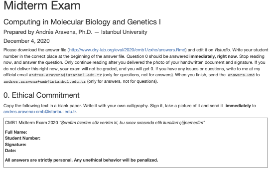

## This is how I wrote exams {.full-h .shadow}

## Dan Ariely

Professor of psychology and behavioral economics, Duke University, USA

Researcher on dishonest behavior

"Signing at the Beginning Makes Ethics Salient and Decreases Dishonest Self-Reports in Comparison to Signing at the End"

2012, PNAS (Proceedings of the National Academy of Sciences)

## Other cases

+ Francesca Gino, Harvard Business School
+ Jason Arday, Cambridge Univ
+ Diederik Stapel,Tilburg Univ. Netherlands
+ Jan Hendrik Schön, Bell Labs

## AI

+ Treat it as "another person"
+ their work is not yours
