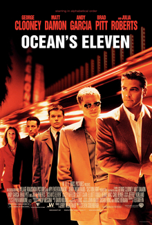
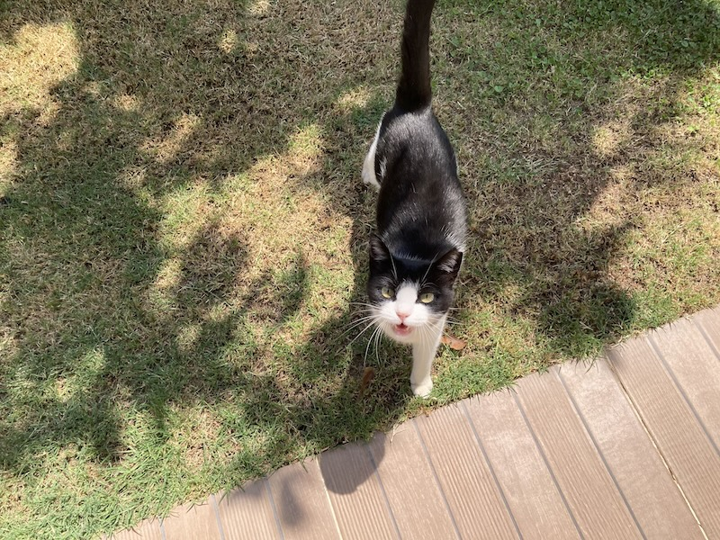

## Have you seen the movie Ocean's Eleven? {.center-h}

::: source
By C@rtelesmix, Fair use, <https://en.wikipedia.org/w/index.php?curid=9045976>
:::

## Do you know these people? {.center-h .full-v .shadow}

::: source
By Airman 1st Class Tanaya M. Harms - U.S. Air Forces in Europe, Public Domain, <https://commons.wikimedia.org/w/index.php?curid=392550>
:::

## Do you know him? What is his name? {.center-h .full-v .shadow}

::: source
By Angela George, CC BY-SA 3.0, <https://commons.wikimedia.org/w/index.php?curid=10256969>
:::

<!-- ## And he? {.center-h .full-v .shadow}

.jpg)

::: source
By Jen from Boston from South Boston, MA - col and Casey Affleck, CC BY 2.0, <https://commons.wikimedia.org/w/index.php?curid=19711626>
::: -->

## Do you know him? {.center-h .full-v .shadow}

::: source
By Collaboration foundation The 1 Second Film derivative work: Nightscream (talk) - Elliot_Gould.jpg, CC BY-SA 3.0, <https://commons.wikimedia.org/w/index.php?curid=7406412>
:::

## Faces are important {.large}

More than names, we remember faces

I guess it is an evolutionary trait

## Faces are important to humans {.full-v .center-h}

## Where does your cat look? {.center-h .full-v .shadow}

# Eye contact {.center}
