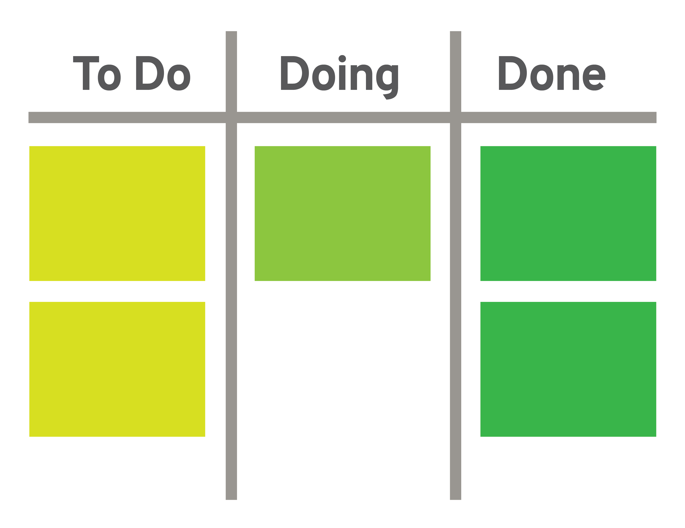
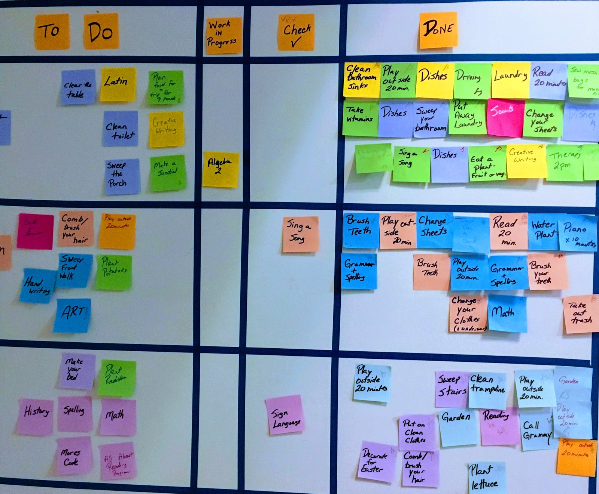
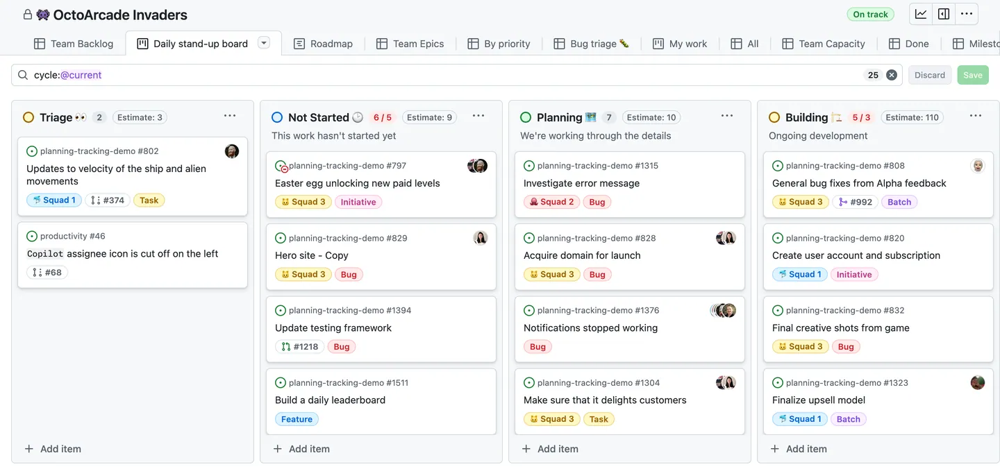
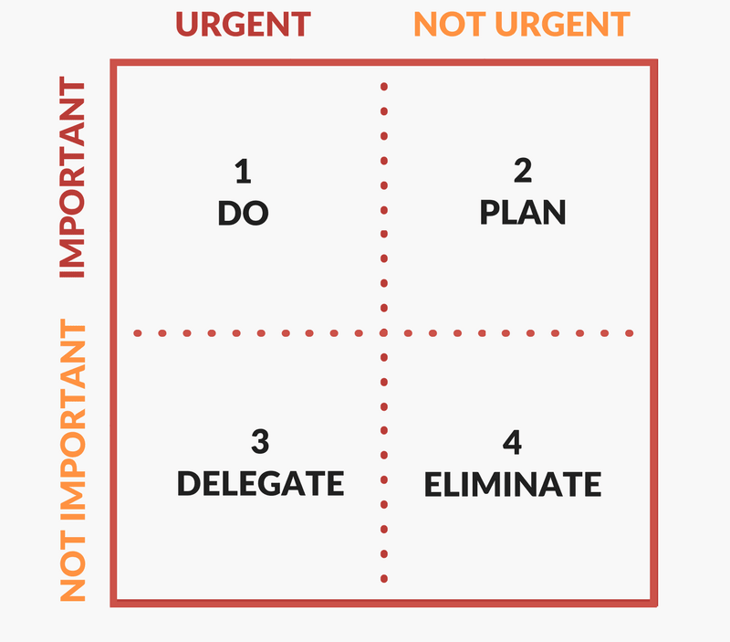

# What to do? {.center .good}

## Kanban {.fl-r .full-v .shadow}

<!--  -->

+ Japanese idea
+ Good for teams, but also personal
+ Write tasks in postit cards
+ Put the cards in three or more columns
+ **Limit the size of _work in progress_**

## Example {.full-v .shadow .center-h}

<!-- source: https://www.5sensesll.com/wp-content/uploads/2020/04/IMG_3741-2.jpg -->

## Digital version  {.full-v .shadow .center-h}

<!-- source: https://docs.github.com/assets/cb-550210/mw-1440/images/help/projects-v2/example-board.webp -->

## Choosing what to do {.full-v .shadow .center-h}

<!-- https://www.duperrin.com/wp-content/uploads/2018/05/Eisenhower-Matrix-Diagram.png -->

# When to do it? {.center .good}
